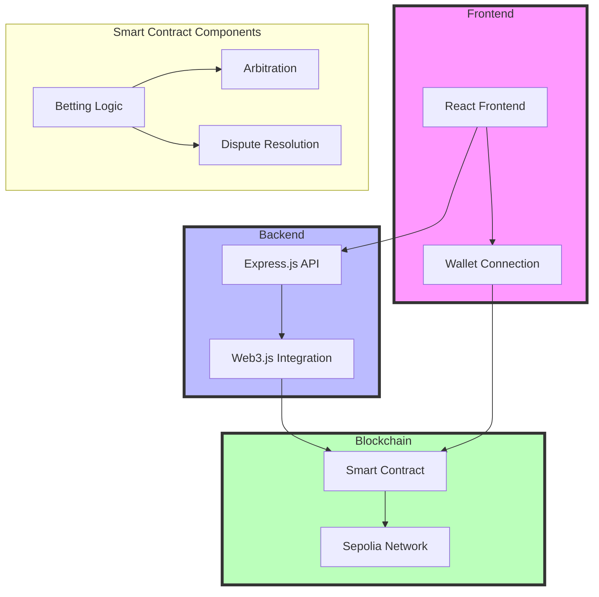

# Seiyuko: Decentralized Social Betting Platform 🎲

> A trustless peer-to-peer betting protocol built on Ethereum



## 🏗️ Technical Architecture

### Smart Contract (Solidity ^0.8.20)
- State Machine Pattern for bet lifecycle management
- Access Control via function modifiers
- Event-driven architecture for off-chain synchronization
- Gas-optimized storage patterns using packed structs
- CEI pattern implementation for security

### Contract Functions
```solidity
function createBet(address participant) public payable
function joinBet(uint betId) public payable
function confirmWinner(uint betId, address winner) public
function disputeBet(uint betId) public
function resolveDispute(uint betId, address winner) public
function cancelBet(uint betId) public
```

### Backend Architecture (Express.js + Web3)
- Asynchronous transaction handling with proper nonce management
- Gas estimation with safety margins
- Transaction signing and broadcasting
- ABI encoding for contract interactions

```javascript
const tx = bettingContract.methods.createBet(participant);
const gas = await tx.estimateGas({ from: account.address, value });
const data = tx.encodeABI();
const nonce = await web3.eth.getTransactionCount(account.address);
```

### Frontend Technical Stack
- React with hooks for state management
- Tailwind CSS with custom gradient implementations
- Dynamic UI animations using CSS transforms
- Event listeners for wallet interactions

```javascript
// Mouse tracking for gradient effect
useEffect(() => {
  const handleMouseMove = (e) => {
    setMousePosition({
      x: e.clientX,
      y: e.clientY,
    });
  };
  window.addEventListener('mousemove', handleMouseMove);
  return () => window.removeEventListener('mousemove', handleMouseMove);
}, []);
```

## 🔧 Core Components

### 🔐 Security Architecture

Our contract implements the Checks-Effects-Interactions (CEI) pattern to prevent reentrancy attacks. The `confirmWinner` and `resolveDispute` functions modify all state variables before executing any external calls, ensuring that recursive calls through the fallback function cannot manipulate contract state. Additionally, state modifications are atomic - we update the `resolved` and `winner` states in a single transaction before transferring funds.

### Event System
```solidity
event BetCreated(uint betId, address creator, address participant, uint amount);
event BetResolved(uint betId, address winner, uint amount);
event ParticipantJoined(uint betId, address participant);
event BetDisputed(uint betId);
event DisputeResolved(uint betId, address winner);
```

## 🛠️ Development Environment

1. Configuration
```bash
npm install
```

2. Environment Setup
```env
INFURA_PROJECT_ID=your_infura_id
PRIVATE_KEY=your_private_key
CONTRACT_ADDRESS=deployed_contract_address
```

3. Local Development
```bash
# Start local hardhat node
npx hardhat node

# Deploy contract
npx hardhat run scripts/deploy.js --network localhost

# Run backend
npm run server

# Run frontend
npm run dev
```

## 🔒 Security Measures

1. **State Management**
   - Atomic state updates
   - CEI pattern implementation
   - Event emission for state tracking
   - Dispute resolution timeouts

2. **Transaction Security**
   - Gas limit calculations
   - Nonce management
   - Safe external calls
   - Value overflow protection

## 🔄 Protocol Flow

1. **Bet Creation**
   - Creator deposits ETH
   - Participant address verification
   - Event emission

2. **Bet Participation**
   - Value matching verification
   - Participant confirmation
   - State transition

3. **Resolution**
   - Double confirmation mechanism
   - Winner verification
   - Atomic state update
   - ETH transfer

4. **Dispute Handling**
   - Arbitrator intervention
   - Time-locked resolution
   - State rollback capability

## 📄 License

MIT