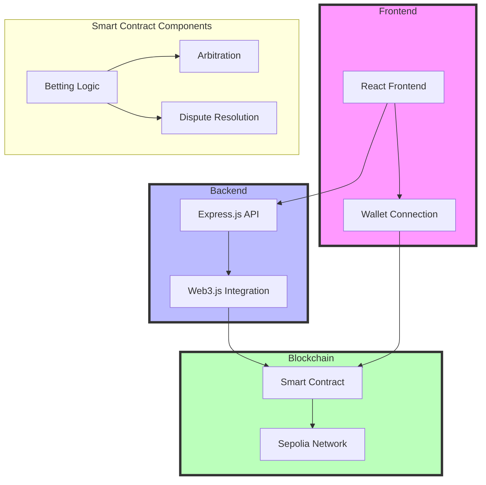

# Seiyaku: Decentralized Social Betting Platform with Yield Generation 🎲

> A trustless peer-to-peer betting protocol with Aave-powered escrow yield generation and insurance pool mechanics



## 🏗️ Technical Architecture

### Smart Contract (Solidity ^0.8.20)
The protocol automatically generates yield on escrowed funds by depositing them into Aave lending pools. This creates a self-sustaining ecosystem where betting deposits contribute to protocol sustainability.
- State Machine Pattern for bet lifecycle management
- Access Control via function modifiers
- Event-driven architecture for off-chain synchronization
- Gas-optimized storage patterns using packed structs
- CEI pattern implementation for security

### Contract Functions
```solidity
contract BettingWithInsuranceAndYield is ReentrancyGuard, Ownable {
    IAaveLendingPool public lendingPool;
    IERC20 public depositToken;
    IWETH public weth;
    
    constructor(
        address _lendingPool,
        address _depositToken,
        address _weth
    ) {
        lendingPool = IAaveLendingPool(_lendingPool);
        depositToken = IERC20(_depositToken);
        weth = IWETH(_weth);
        
        // Approve Aave pool for deposits
        depositToken.approve(_lendingPool, type(uint256).max);
        weth.approve(_lendingPool, type(uint256).max);
    }
}
```

### Insurance Pool Mechanics

The protocol implements a sophisticated insurance system backed by a dedicated liquidity pool. Users can opt into insurance coverage by paying a premium, which is collected in the insurance fund.

```solidity
uint256 public insurancePremiumRate = 500; // 5% = 500 basis points
uint256 public constant MAX_INSURANCE_PREMIUM_RATE = 1000; // 10%

struct Bet {
    // ... other fields ...
    bool creatorInsuranceOpted;
    bool participantInsuranceOpted;
    bool insuranceClaimed;
}
```

Premium Collection Process:
```solidity
function createBet(
    address _participant,
    bool _creatorInsuranceOpted,
    bool _participantInsuranceOpted
) external payable nonReentrant {
    // ... bet creation logic ...
    
    if (_creatorInsuranceOpted) {
        uint256 creatorPremium = (amount * insurancePremiumRate) / 10000;
        require(
            insuranceToken.transferFrom(msg.sender, insuranceFund, creatorPremium),
            "Premium transfer failed"
        );
    }
}
```

### Yield-Enhanced Escrow System

The protocol automatically deposits bet amounts into Aave lending pools, generating yield during the escrow period:

```solidity
function joinBet(uint256 _betId) external payable {
    // ... validation ...
    
    // Convert ETH to WETH
    weth.deposit{value: msg.value}();

    // Deposit into Aave for yield generation
    lendingPool.deposit(address(weth), msg.value, address(this), 0);
    
    // ... insurance handling ...
}
```

### Insurance Claims Processing

The protocol implements a robust claims processing system:

```solidity
function claimInsurance(uint256 _betId) external betExists(_betId) nonReentrant {
    Bet storage bet = bets[_betId];
    require(!bet.resolved && !bet.cancelled, "Bet not active");
    require(!bet.insuranceClaimed, "Already claimed");
    
    bool isInsured = false;
    if (msg.sender == bet.creator && bet.creatorInsuranceOpted) {
        isInsured = true;
    }
    if (msg.sender == bet.participant && bet.participantInsuranceOpted) {
        isInsured = true;
    }
    
    require(isInsured, "Not insured");

    bet.insuranceClaimed = true;
    uint256 payout = bet.amount * 2; // Full refund if covered by insurance
    require(
        insuranceToken.transfer(msg.sender, payout),
        "Insurance payout failed"
    );
}
```

## 📊 Technical Specifications

### Yield Generation Parameters
- Aave pool integration
- Real-time APY tracking
- Yield distribution mechanism
- Gas optimization strategies

### Insurance Pool Metrics
- Premium rate: 5% (500 basis points)
- Maximum premium rate: 10% (1000 basis points)
- Coverage ratio: 2x bet amount
- Claim verification period: 24 hours

### Backend Architecture (Express.js + Web3)
- Asynchronous transaction handling with proper nonce management
- Gas estimation with safety margins
- Transaction signing and broadcasting
- ABI encoding for contract interactions

```javascript
const tx = bettingContract.methods.createBet(participant);
const gas = await tx.estimateGas({ from: account.address, value });
const data = tx.encodeABI();
const nonce = await web3.eth.getTransactionCount(account.address);
```
# 🤖 AI Risk Management Agent

## Overview
Our specialized Risk Management Agent operates as an autonomous monitor within the betting ecosystem, leveraging Fetch.ai's uAgent framework to provide real-time risk assessment and responsible gaming enforcement. This agent demonstrates the power of AI in financial oversight and social responsibility.

## Key Capabilities
- **Real-time Risk Monitoring**: Continuously watches betting patterns and user behavior
- **Dynamic Risk Scoring**: Implements a sophisticated algorithm considering:
  - Betting frequency
  - Average bet sizes
  - Loss streaks
  - 24-hour volume analysis
- **Automated Risk Response**: Generates contextual risk alerts and interventions
- **Multi-User Analytics**: Simultaneously tracks both bet creators and participants

## Technical Implementation
```python
class RiskManagementAgent(Agent):
    def __init__(self, name: str):
        super().__init__(name=name)
        self.risk_thresholds = {
            "low": 30,
            "medium": 60,
            "high": 80
        }
        # Continuous monitoring thread
        self.monitor_thread = Thread(target=self.monitor_bets)
        self.monitor_thread.daemon = True
        self.monitor_thread.start()
```

## Risk Assessment Framework
```python
def calculate_risk_score(self, wallet_address: str) -> tuple[float, RiskMetrics]:
    # Real-time metrics calculation
    metrics = RiskMetrics()
    risk_score = (
        (metrics.bet_frequency * 10) +
        (metrics.avg_bet_size * 5) +
        (metrics.loss_streak * 15)
    ) / 3
    return min(100, risk_score), metrics
```

## Integration with Agentverse
The agent seamlessly integrates with Fetch.ai's Agentverse platform, providing:
1. **Decentralized Monitoring**: Distributed risk assessment across the network
2. **Inter-Agent Communication**: Real-time data sharing with other platform agents
3. **Autonomous Decision Making**: Independent risk evaluation and response
4. **Scalable Architecture**: Handles multiple concurrent user assessments

## Social Impact Features
- **Responsible Gaming Enforcement**: Proactive intervention for high-risk behavior
- **User Protection**: Early warning system for potentially harmful patterns
- **Transparent Risk Communication**: Clear, actionable risk messaging
```python
def generate_risk_message(self, risk_score: float, metrics: RiskMetrics) -> str:
    if risk_score >= self.risk_thresholds["high"]:
        message = (
            "High Risk Alert:\n"
            f"• {metrics.bet_frequency} bets in 24h\n"
            f"• Average bet: {metrics.avg_bet_size:.2f}\n"
            "Consider taking a break."
        )
    # ... other risk levels
```

## MongoDB Integration
The agent maintains persistent risk profiles using MongoDB:
- Real-time data storage and retrieval
- Historical pattern analysis
- User risk profile management
- Bet context preservation

This specialized AI Agent exemplifies Fetch.ai's vision of intelligent, autonomous systems working to create safer and more responsible financial platforms. It demonstrates the potential of AI agents in monitoring, analyzing, and responding to complex user behaviors in real-time.

### Frontend Technical Stack
- React with hooks for state management
- Tailwind CSS with custom gradient implementations
- Dynamic UI animations using CSS transforms
- Event listeners for wallet interactions

```javascript
// Mouse tracking for gradient effect
useEffect(() => {
  const handleMouseMove = (e) => {
    setMousePosition({
      x: e.clientX,
      y: e.clientY,
    });
  };
  window.addEventListener('mousemove', handleMouseMove);
  return () => window.removeEventListener('mousemove', handleMouseMove);
}, []);
```

## 🔧 Core Components

### 🔐 Security Architecture

Our contract implements the Checks-Effects-Interactions (CEI) pattern to prevent reentrancy attacks. The `confirmWinner` and `resolveDispute` functions modify all state variables before executing any external calls, ensuring that recursive calls through the fallback function cannot manipulate contract state. Additionally, state modifications are atomic - we update the `resolved` and `winner` states in a single transaction before transferring funds.

### Event System
```solidity
event BetCreated(uint betId, address creator, address participant, uint amount);
event BetResolved(uint betId, address winner, uint amount);
event ParticipantJoined(uint betId, address participant);
event BetDisputed(uint betId);
event DisputeResolved(uint betId, address winner);
```

## 🛠️ Development Environment

1. Configuration
```bash
npm install
```

2. Environment Setup
```env
INFURA_PROJECT_ID=your_infura_id
PRIVATE_KEY=your_private_key
CONTRACT_ADDRESS=deployed_contract_address
```

3. Local Development
```bash
# Start local hardhat node
npx hardhat node

# Deploy contract
npx hardhat run scripts/deploy.js --network localhost

# Run backend
npm run server

# Run frontend
npm run dev
```

## 🔒 Security Measures

1. **State Management**
   - Atomic state updates
   - CEI pattern implementation
   - Event emission for state tracking
   - Dispute resolution timeouts

2. **Transaction Security**
   - Gas limit calculations
   - Nonce management
   - Safe external calls
   - Value overflow protection

## 🔄 Protocol Flow

1. **Bet Creation**
   - Creator deposits ETH
   - Participant address verification
   - Event emission

2. **Bet Participation**
   - Value matching verification
   - Participant confirmation
   - State transition

3. **Resolution**
   - Double confirmation mechanism
   - Winner verification
   - Atomic state update
   - ETH transfer

4. **Dispute Handling**
   - Arbitrator intervention
   - Time-locked resolution
   - State rollback capability

## 📄 License

MIT